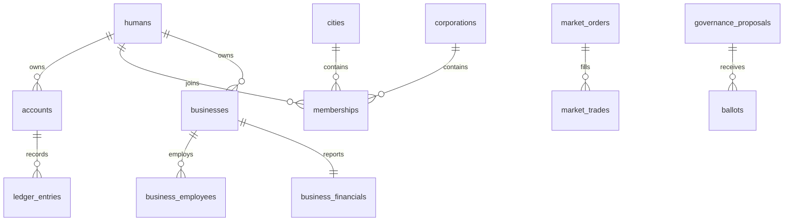

# Core schema ERD

```mermaid
erDiagram
  humans ||--o{ accounts : owns
  accounts ||--o{ ledger_entries : records
  humans ||--o{ memberships : joins
  cities ||--o{ memberships : contains
  corporations ||--o{ memberships : contains
  humans ||--o{ businesses : owns
  businesses ||--o{ business_employees : employs
  businesses ||--|| business_financials : reports
  market_orders ||--o{ market_trades : fills
  governance_proposals ||--o{ ballots : receives
```

The source of truth is the append-only migration history under `db/migrations`.
