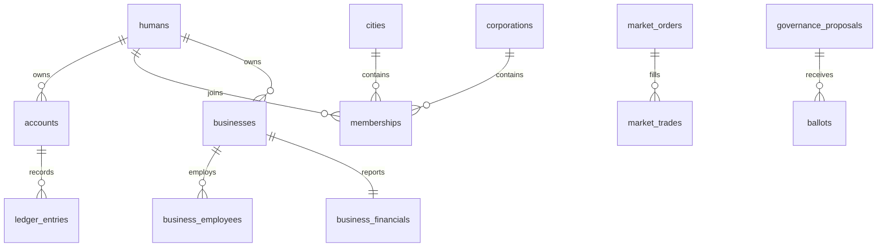

# Core schema ERD

The immutable foundation is the clean baseline under `db/baseline/`, applied by
`db/migrations/001_baseline.sql` (schema version `1`). During pre-production
reconciliation, active forward migrations such as
`db/migrations/002_communities_v2.sql` are applied afterward. These temporary
migrations will be folded into the final baseline only after all retained
features pass fresh-database certification; future permanent changes then begin
at `002_...`.
